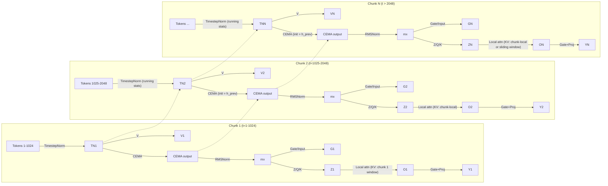
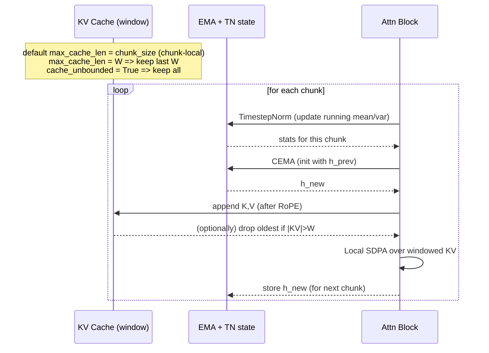
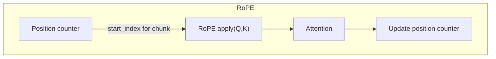

# Megalodon Long-Context Streaming (Conceptual Flow)

This note sketches how "unlimited context" is achieved without holding a global KV cache. The long-range signal flows through **stateful EMA + TimestepNorm**, while attention uses a **local KV** (chunk-local by default; optional sliding window).

Assume `chunk_size = 1024` and a 17,000-token sequence (17 chunks). Attention stays chunk-local by default; EMA/Norm carry the full history. A sliding KV window is an optional extension.

## 1) Chunked Attention vs. Stateful Memory

- **Long-range path:** CEMA state `h` + TimestepNorm running stats propagate across all chunks (O(1) memory). This is the "unlimited" context carrier.
- **Local path:** Attention uses only a local KV window (within chunk or sliding window). Older KV can be dropped once their effect is absorbed into EMA/Norm state.

## 2) Optional Sliding KV Window (decode)

- Default behavior clamps KV to one chunk (`max_cache_len = chunk_size`); chunk-local streaming calls can span boundaries and are processed chunk-by-chunk with cache reset at each boundary.
- A finite `max_cache_len` above the chunk size enables a sliding window.
- Setting `cache_unbounded=True` keeps all KV (VRAM grows linearly).

## 3) RoPE Offsets

- We track absolute positions so rotary phases remain continuous across chunks, even when KV is trimmed.

## 4) Training vs. Inference

- **Training:** block-diagonal attention per chunk; EMA uses FFT (no cache).
- **Inference:** sequential EMA; attention is chunk-local by default with optional sliding/unbounded KV; RoPE offset advances with absolute position.

## Defaults and Options

- **Upstream reference:** trims KV to one chunk; enforces `cache_len + seq_len <= chunk_size`.
- **Paper spirit:** "unlimited" via EMA + stateful norms; KV need not be global.
- **This repo:** default `max_cache_len = chunk_size` (faithful, chunk-local). Set `max_cache_len` above `chunk_size` for sliding-window attention; use `cache_unbounded=True` to disable clamping.
