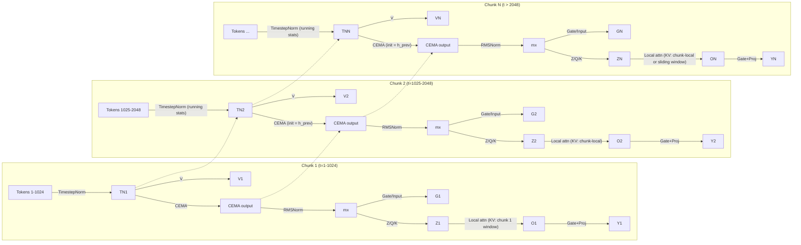
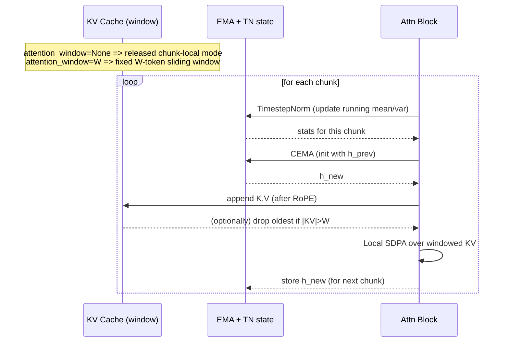
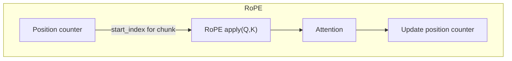

# Megalodon Long-Context Streaming (Conceptual Flow)

This note sketches how "unlimited context" is achieved without holding a global KV cache. The long-range signal flows through **stateful EMA + TimestepNorm**, while attention uses a **local KV** (chunk-local by default; optional sliding window).

Assume `chunk_size = 1024` and a 17,000-token sequence (17 chunks). Attention stays chunk-local by default; EMA/Norm carry the full history. A sliding KV window is an optional extension.

## 1) Chunked Attention vs. Stateful Memory

```mermaid
flowchart LR
    subgraph Chunk1["Chunk 1 (t=1-1024)"]
        A1[Tokens 1-1024] -->|TimestepNorm| TN1
        TN1 -->|CEMA| C1[CEMA output]
        C1 -->|RMSNorm| MX1[mx]
        MX1 -->|Z/Q/K| Z1
        TN1 -->|V| V1
        MX1 -->|Gate/Input| G1
        Z1 -->|"Local attn (KV: chunk 1 window)"| O1
        O1 -->|Gate+Proj| Y1
    end

    subgraph Chunk2["Chunk 2 (t=1025-2048)"]
        A2[Tokens 1025-2048] -->|"TimestepNorm (running stats)"| TN2
        TN2 -->|"CEMA (init = h_prev)"| C2[CEMA output]
        C2 -->|RMSNorm| MX2[mx]
        MX2 -->|Z/Q/K| Z2
        TN2 -->|V| V2
        MX2 -->|Gate/Input| G2
        Z2 -->|"Local attn (KV: chunk-local)"| O2
        O2 -->|Gate+Proj| Y2
    end

    subgraph ChunkN["Chunk N (t > 2048)"]
        AN[Tokens ...] -->|"TimestepNorm (running stats)"| TNN
        TNN -->|"CEMA (init = h_prev)"| CN[CEMA output]
        CN -->|RMSNorm| MXN[mx]
        MXN -->|Z/Q/K| ZN
        TNN -->|V| VN
        MXN -->|Gate/Input| GN
        ZN -->|"Local attn (KV: chunk-local or sliding window)"| ON
        ON -->|Gate+Proj| YN
    end

    C1 -.-> C2
    C2 -.-> CN
    TN1 -.-> TN2
    TN2 -.-> TNN
```

- **Long-range path:** CEMA state `h` + TimestepNorm running stats propagate across all chunks (O(1) memory). This is the "unlimited" context carrier.
- **Local path:** Attention uses only a local KV window (within chunk or sliding window). Older KV can be dropped once their effect is absorbed into EMA/Norm state.

## 2) Optional Sliding KV Window (decode)

```mermaid
sequenceDiagram
    participant Cache as KV Cache (window)
    participant State as EMA + TN state
    participant Block as Attn Block
    Note over Cache: attention_window=None => released chunk-local mode<br/>attention_window=W => fixed W-token sliding window

    Loop for each chunk
        Block->>State: TimestepNorm (update running mean/var)
        State-->>Block: stats for this chunk
        Block->>State: CEMA (init with h_prev)
        State-->>Block: h_new
        Block->>Cache: append K,V (after RoPE)
        Cache-->>Block: (optionally) drop oldest if |KV|>W
        Block->>Block: Local SDPA over windowed KV
        Block-->>State: store h_new (for next chunk)
    end
```

- `attention_window=None` is the released chunk-local behavior. The fixed ring capacity is `chunk_size`, and attention/RoPE restart at each source chunk boundary.
- `attention_window=W` enables the intentional fixed-width sliding-window extension with ring capacity `W` and a per-query age mask.
- Both modes are invariant to call partitioning: full calls, arbitrary chunks, token-by-token calls, and save/reload continuation produce the same outputs for identical semantics.

## 3) RoPE Offsets

```mermaid
flowchart TD
    subgraph RoPE
        P0[Position counter] -->|start_index for chunk| R1["RoPE apply(Q,K)"]
        R1 --> O[Attention]
        O --> P1[Update position counter]
    end
```

- The cache tracks absolute token count. Released chunk-local mode derives RoPE position as `absolute_position % chunk_size`, matching the source's per-chunk coordinate restart. Sliding-window mode uses absolute positions so retained keys and new queries remain in one coordinate system.

## 4) Training vs. Inference

- **Training:** `attention_window=None` gives released block-diagonal attention per chunk; setting `attention_window` opts into sliding attention. EMA uses FFT when no state/reset is required. Packed rows may pass `segment_ids`/`position_ids` for full per-document isolation; see [dev.md](dev.md#packed-sequence-state-isolation).
- **Inference:** sequential EMA; attention is chunk-local by default with optional sliding KV. RoPE restarts per source chunk in faithful mode and remains absolute in sliding mode. Packed metadata is rejected on any cached/streaming call before compute.

## 5) Padding and Generation

- In this JAX implementation, cached decoding does not support padding because cache validity is not tracked per position.
- `generate()` rejects padded `attention_mask` when cached generation is requested (`max_new_tokens > 1`, `return_cache=True`, or a cache is provided).
- For variable-length prompts, trim/pad on the caller side or loop over prompts.

## Defaults and Options

- **Original release:** chunk-local attention with per-chunk RoPE coordinates; long-range information flows through CEMA and stateful normalization.
- **Paper theory:** "unlimited" context is carried by recurrent state rather than an unbounded global KV cache.
- **This repo:** `attention_window=None` preserves released behavior. A positive `attention_window` explicitly opts into the partition-invariant sliding extension.
