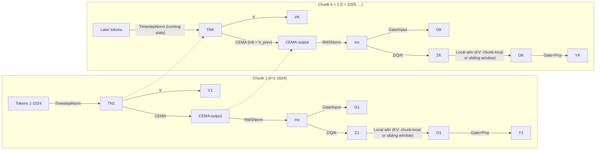
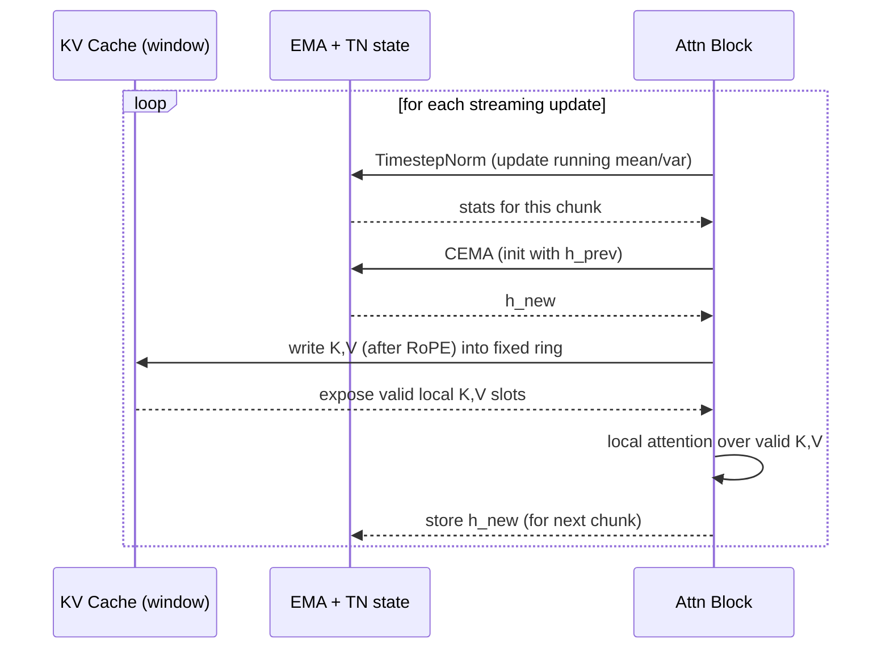

# Long-context streaming

Megalodon carries long-range signal through stateful CEMA and TimestepNorm without retaining a global KV cache. Attention only sees a local window of keys and values: chunk-local by default, matching the released implementation ("released" throughout these docs means the original released PyTorch/CUDA source), or an optional fixed-width sliding window.

The examples below assume `chunk_size = 1024` and a 17,000-token sequence (17 chunks). Attention stays chunk-local; CEMA and TimestepNorm carry the full history.

---

- [Chunked attention and stateful memory](#chunked-attention-and-stateful-memory)
- [Optional sliding KV window](#optional-sliding-kv-window)
- [Cache integrity and indexing](#cache-integrity-and-indexing)
- [RoPE offsets](#rope-offsets)
- [Training and inference](#training-and-inference)
- [Packed-sequence training](#packed-sequence-training)
- [Padding and generation](#padding-and-generation)

---

## Chunked attention and stateful memory


```mermaid
flowchart LR
    subgraph Chunk1["Chunk 1 (t=1-1024)"]
        A1[Tokens 1-1024] -->|TimestepNorm| TN1
        TN1 -->|CEMA| C1[CEMA output]
        C1 -->|RMSNorm| MX1[mx]
        MX1 -->|Z/Q/K| Z1
        TN1 -->|V| V1
        MX1 -->|Gate/Input| G1
        Z1 -->|"Local attn (KV: chunk-local or sliding window)"| O1
        O1 -->|Gate+Proj| Y1
    end

    subgraph ChunkK["Chunk k > 1 (t = 1025, ...)"]
        AK[Later tokens] -->|"TimestepNorm (running stats)"| TNK
        TNK -->|"CEMA (init = h_prev)"| CK[CEMA output]
        CK -->|RMSNorm| MXK[mx]
        MXK -->|Z/Q/K| ZK
        TNK -->|V| VK
        MXK -->|Gate/Input| GK
        ZK -->|"Local attn (KV: chunk-local or sliding window)"| OK
        OK -->|Gate+Proj| YK
    end

    C1 -.-> CK
    TN1 -.-> TNK
```

- **Long-range path:** CEMA state `h` and TimestepNorm running statistics propagate across all chunks in O(1) state memory.
- **Local path:** Attention uses only its defined chunk or sliding-window support. Keys outside that support are discarded independently of the recurrent state path.

## Optional sliding KV window


```mermaid
sequenceDiagram
    participant Cache as KV Cache (window)
    participant State as EMA + TN state
    participant Block as Attn Block

    loop for each streaming update
        Block->>State: TimestepNorm (update running mean/var)
        State-->>Block: stats for this chunk
        Block->>State: CEMA (init with h_prev)
        State-->>Block: h_new
        Block->>Cache: write K,V (after RoPE) into fixed ring
        Cache-->>Block: expose valid local K,V slots
        Block->>Block: local attention over valid K,V
        Block-->>State: store h_new (for next chunk)
    end
```

- `attention_window=None` is the released chunk-local behavior. The fixed ring capacity is `chunk_size`, and attention/RoPE restart at each source chunk boundary.
- `attention_window=W` enables the intentional fixed-width sliding-window extension with ring capacity `W` and a per-query token-order age mask. Explicit `position_ids` affect RoPE coordinates only; they never change causal or window support.
- Uncached sliding-window attention materializes dense sequence-by-sequence scores and masks before applying the window, so training and prompt prefill remain O(L^2) in sequence length. Cached continuation uses the fixed-width ring. This extension is not a banded long-sequence training implementation.
- Both modes are invariant to call partitioning: full calls, arbitrary chunks, token-by-token calls, and save/reload continuation produce the same outputs for identical semantics.

## Cache integrity and indexing

Top-level `ModelCache` values use exactly two schemas: the sparse initializer has `None` for every layer and final normalization state, while a continuation contains every attention, TimestepNorm, CEMA, and final-normalization component. Direct `MegalodonBlock` calls separately accept either an empty `LayerCache()` or complete layer state on one nonnegative timeline. Validation is fail-closed:

- Model and block entry points reject partial or misaligned state, invalid array schemas, non-finite normalization values, and negative variances.
- Model entry additionally checks EMA state for finiteness.
- Cache input or output requires deterministic inference.
- Persistence validates the full K/V payload as described in [Inference state persistence](jax-torch.md#inference-state-persistence).

`index_cache(cache, indices)` reorders or duplicates allocated batch state for beam search. Indices must be a rank-one int32 array within the allocated batch range; repeated, reordered, and empty selections are supported. A sparse cache without allocated batch state accepts only an empty selection.

## RoPE offsets

- The cache tracks absolute token count. Released chunk-local mode derives RoPE position as `absolute_position % chunk_size`, matching the source's per-chunk coordinate restart. Sliding-window mode uses absolute positions so retained keys and new queries remain in one coordinate system.
- The model resolves positions once per call, evaluates one FP32 cosine/sine table, and shares it across every layer (an optimization barrier keeps it outside rematerialized blocks). This is a performance optimization only: coordinates and checkpoint contents are unchanged, and standalone attention modules still derive the same factors locally.

## Training and inference

- **Training:** `attention_window=None` gives released block-diagonal attention per chunk; setting `attention_window` opts into sliding attention. CEMA uses FFT when no state or packed reset is required.
- **Inference:** pristine prefill uses vectorized attention and FFT CEMA outputs while materializing final continuation state. Calls with nonzero history use tokenwise attention ring updates; CEMA uses the sequential recurrence for cached chunks shorter than 32 tokens and FFT plus an initial-state bias otherwise (see [EMA implementation](ema-implementation.md#execution-paths)). RoPE restarts per source chunk in chunk-local mode and remains absolute in sliding mode.

## Packed-sequence training

`segment_ids` isolates contiguous documents across attention, CEMA, TimestepNorm, RoPE, gradients, and shifted loss pairs. Positive values identify real tokens and zero identifies padding. Raw IDs may be reused for non-adjacent documents because boundaries are defined by changes between neighboring IDs, not by global ID equality.

At model entry, `segment_ids` is converted once into a small derived pytree (validity, reset boundaries, contiguous-run IDs, run-local positions) that every layer's attention, CEMA, and TimestepNorm consume. This is an internal optimization only; direct layer calls derive identical values locally, and the regression suite verifies outputs and gradients match between the two paths.

A minimal one-row packing recipe is below. Documents must already be tokenized and include any desired BOS/EOS tokens; packing does not manufacture boundary tokens. A production bin-packer can choose document groups for each row, then apply the same metadata construction.

```python
import jax.numpy as jnp


def pack_row(documents, *, row_length, pad_token_id):
    tokens = []
    segments = []
    for segment_id, document in enumerate(documents, start=1):
        document = list(document)
        if not document:
            continue
        if len(tokens) + len(document) > row_length:
            raise ValueError("documents do not fit in one packed row")
        tokens.extend(document)
        segments.extend([segment_id] * len(document))

    padding = row_length - len(tokens)
    input_ids = jnp.asarray(
        [tokens + [pad_token_id] * padding],
        dtype=jnp.int32,
    )
    segment_ids = jnp.asarray(
        [segments + [0] * padding],
        dtype=jnp.int32,
    )
    labels = input_ids
    return input_ids, segment_ids, labels


input_ids, segment_ids, labels = pack_row(
    [[101, 17, 18, 102], [101, 29, 30, 31, 102]],
    row_length=12,
    pad_token_id=0,
)
attention_mask = segment_ids > 0
loss = model.compute_loss(
    input_ids,
    labels,
    attention_mask=attention_mask,
    segment_ids=segment_ids,
)
```

`labels = input_ids` is correct because `compute_loss` shifts labels internally and removes cross-segment target pairs. Segment zero removes padded targets independently of the numeric `pad_token_id`; the explicit attention mask also prevents padding from entering model state. Omit `position_ids` to get document-local RoPE positions automatically.

- Packed metadata is training-only. `segment_ids` and `position_ids` are rejected whenever `return_cache=True` or a complete (non-sparse) cache is supplied; the sparse zero-history `ModelCache` is treated as no cache.
- When `position_ids` is omitted, RoPE positions restart automatically at each contiguous document boundary.
- Chunk boundaries re-anchor at each document, so a document beginning partway through a physical batch chunk has the same block-diagonal attention pattern as an independent run.
- CEMA and TimestepNorm reset at every boundary. Trailing padding does not replace the returned state of the last real token, and an all-padding row returns fresh state.
- `compute_loss` excludes targets in segment zero and shifted pairs that cross a document boundary. An `attention_mask` alone applies to target positions; use `ignore_index` labels when stricter loss exclusion is required.

The segmented CEMA path and its memory/speed tradeoff are described in [EMA implementation](ema-implementation.md#segmented-path). Harnesses can detect complete packed-state support with `getattr(model, "supports_segment_reset", False)`.

## Padding and generation

> [!IMPORTANT]
> Cached decoding does not support padded batches because cache validity is not tracked per position. Batch variable-length prompts by equal unpadded length, or generate them separately when a cache is required.

- `generate()` rejects padded `attention_mask` when cached generation is requested (`max_new_tokens > 1`, `return_cache=True`, `return_state=True`, or a cache/state is provided).
- Model calls require every `attention_mask` row to be a contiguous valid prefix followed by optional right padding. Left padding and interior masked holes are rejected because shifting physical chunk boundaries changes released chunk-local semantics. `generate()` accepts right padding only for a single uncached generated token; direct noncached model calls support right-padded training batches.
- Pass `attention_mask=None` when every token is valid. `generate()` canonicalizes an all-True mask to `None`; direct model calls retain an array-valued mask and therefore use the general masked TimestepNorm path.
- An empty prompt without prior state is replaced by the explicit `bos_token_id` argument or the model configuration's BOS token.
- Exact generator continuation uses `GenerationState` with an empty `(batch, 0)` prompt. The state cache includes every emitted token, `next_logits` contains the logits produced after the final token, and `finished` plus static EOS metadata preserves fixed-shape mixed-batch stopping. The explicit PRNG key returned by `generate()` remains separate and must be passed to the resumed call for exact stochastic continuation.
- `generate()` is the eager public boundary: it validates shapes, sampling controls, special-token metadata, continuation state, and padding rules before entering a private `eqx.filter_jit` core. Generation length, sampling policy, EOS choice, artifact form, and model configuration are static compilation inputs; model/cache/prompt/key arrays are dynamic. Reusing the same shapes and static controls reuses the compiled program. No public `generate_jit` alias exists.
- A raw `ModelCache` (from `cache=`/`return_cache=True`) is model-forward continuation state only: it lacks next-token logits and per-row EOS status, so it cannot resume `generate()`. Empty-prompt continuation requires `GenerationState`.
- `max_new_tokens` must be a positive, non-boolean integer. Explicit BOS and EOS overrides must be integer IDs within `vocab_size`.
- `generate()` requires the output width to equal `vocab_size` so every generated ID is valid for the next embedding lookup.
- Batched generation is fixed-shape. After one row emits EOS, that row continues with synthetic EOS tokens until the batch completes; a returned raw cache or `GenerationState.cache` matches the full rectangular result, not the row trimmed at its first EOS.
- Cache input and cache return are deterministic inference operations. Model calls with `deterministic=False` reject both.

```python
import jax.numpy as jnp

from megalodon_jax import generate

tokens, state, key = generate(
    model,
    prompt_ids,
    max_new_tokens=8,
    key=key,
    return_state=True,
)
continued, state, key = generate(
    model,
    jnp.empty((prompt_ids.shape[0], 0), dtype=jnp.int32),
    max_new_tokens=8,
    key=key,
    state=state,
    return_state=True,
)
```

Token IDs never imply padding. `pad_token_id` is metadata; callers must supply masks and keep unknown-token IDs distinct from padding metadata.
